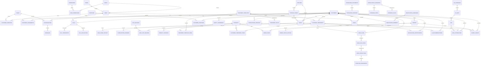

# ERD CRM quản trị khách hàng tiêu hóa

```mermaid
erDiagram
    ROLES ||--o{ USERS : assigns
    TEAMS ||--o{ USERS : contains
    ROLES ||--o{ ROLE_PERMISSIONS : has
    PERMISSIONS ||--o{ ROLE_PERMISSIONS : grants

    CUSTOMERS ||--o{ CUSTOMER_IDENTITIES : has
    PAGES ||--o{ CUSTOMER_IDENTITIES : source
    CUSTOMERS ||--o{ CUSTOMER_ASSIGNMENTS : assigned
    USERS ||--o{ CUSTOMER_ASSIGNMENTS : owns
    CUSTOMERS ||--o{ CONVERSATIONS : has
    PAGES ||--o{ CONVERSATIONS : receives
    CONVERSATIONS ||--o{ MESSAGES : contains
    CUSTOMERS ||--o{ CALLS : has
    USERS ||--o{ CALLS : handles
    CALLS ||--o{ CALL_TRANSCRIPTS : transcribes
    CALLS ||--o{ CALL_EVALUATIONS : evaluates

    CUSTOMERS ||--o{ LEADS : has
    PIPELINES ||--o{ PIPELINE_STAGES : contains
    PIPELINES ||--o{ LEADS : manages
    PIPELINE_STAGES ||--o{ LEADS : current_stage
    LEADS ||--o{ LEAD_STAGE_HISTORY : history
    CUSTOMERS ||--o{ CONSULTATION_SESSIONS : has
    CONSULTATION_SESSIONS ||--o{ CONSULTATION_ANSWERS : records
    CUSTOMERS ||--o{ CUSTOMER_SYMPTOMS : reports
    SYMPTOMS ||--o{ CUSTOMER_SYMPTOMS : classifies
    CUSTOMERS ||--o{ SAFETY_SCREENINGS : screened
    LEADS ||--o{ LEAD_LOST_REASONS : loses_for
    LOST_REASONS ||--o{ LEAD_LOST_REASONS : classifies

    PRODUCTS ||--o{ PRODUCT_VERSIONS : versions
    TREATMENT_TEMPLATES ||--o{ TREATMENT_TEMPLATE_ITEMS : includes
    PRODUCTS ||--o{ TREATMENT_TEMPLATE_ITEMS : belongs
    TREATMENT_TEMPLATES ||--o{ TREATMENT_RULES : governed_by
    CUSTOMERS ||--o{ CUSTOMER_TREATMENTS : receives
    TREATMENT_TEMPLATES ||--o{ CUSTOMER_TREATMENTS : instantiates
    CUSTOMER_TREATMENTS ||--o{ CUSTOMER_TREATMENT_ITEMS : contains
    PRODUCTS ||--o{ CUSTOMER_TREATMENT_ITEMS : used
    CUSTOMERS ||--o{ ORDERS : places
    ORDERS ||--o{ ORDER_ITEMS : contains
    PRODUCTS ||--o{ ORDER_ITEMS : sold
    ORDERS ||--o{ ORDER_STATUS_HISTORY : changes

    CUSTOMERS ||--o{ CARE_PLANS : has
    CUSTOMER_TREATMENTS ||--o{ CARE_PLANS : drives
    CARE_PLANS ||--o{ CARE_PLAN_STEPS : schedules
    CARE_PLAN_STEPS ||--o{ CARE_INTERACTIONS : completed_by
    CARE_INTERACTIONS ||--o{ SYMPTOM_ASSESSMENTS : measures
    CUSTOMERS ||--o{ TASKS : requires
    USERS ||--o{ TASKS : assigned
    CUSTOMERS ||--o{ REPURCHASE_OPPORTUNITIES : creates
    CUSTOMER_TREATMENTS ||--o{ REPURCHASE_OPPORTUNITIES : triggers
    REACTIVATION_CAMPAIGNS ||--o{ REACTIVATION_MEMBERS : contains
    CUSTOMERS ||--o{ REACTIVATION_MEMBERS : included

    KNOWLEDGE_DOCUMENTS ||--o{ KNOWLEDGE_VERSIONS : versions
    CONSULTATION_SCENARIOS ||--o{ SCENARIO_STEPS : contains
    CONSULTATION_SCENARIOS ||--o{ SCENARIO_RULES : governed_by
    CUSTOMERS ||--o{ AI_RECOMMENDATIONS : receives
    CONSULTATION_SESSIONS ||--o{ AI_RECOMMENDATIONS : produces

    AD_CAMPAIGNS ||--o{ AD_SETS : contains
    AD_SETS ||--o{ ADS : contains
    CUSTOMERS ||--o{ LEAD_ATTRIBUTIONS : attributed
    LEADS ||--o{ LEAD_ATTRIBUTIONS : tracks
    ADS ||--o{ LEAD_ATTRIBUTIONS : source
    CUSTOMERS ||--o{ FUNNEL_EVENTS : generates
    LEADS ||--o{ FUNNEL_EVENTS : progresses
    ORDERS ||--o{ FUNNEL_EVENTS : converts
```
