# ERD CRM quản trị khách hàng tiêu hóa

Sơ đồ này **sinh tự động từ schema `crm`** trong Postgres (`scripts/init_crm.sql`),
nên luôn khớp với database thật: **56 bảng · 92 khóa ngoại**.

> Sơ đồ chỉ vẽ **quan hệ**, không vẽ cột. Muốn xem cột thì mở
> [DANH-SACH-BANG-VA-QUAN-HE.md](DANH-SACH-BANG-VA-QUAN-HE.md) hoặc chạy
> `\d crm.<tên_bảng>` trong psql.

Khác với bản vẽ tay trước đó:

- Bổ sung `TAGS` + `CUSTOMER_TAGS` (bản cũ thiếu hẳn 2 bảng này).
- `LOST_REASONS` đổi tên thành `LEAD_REASONS` cho khớp DB và tài liệu 56 bảng —
  bảng này chứa cả lý do thắng, thua lẫn hoãn, dùng chung cho `LEAD_LOST_REASONS`
  và `REPURCHASE_OPPORTUNITIES`.
- Bổ sung các đường trỏ về `USERS` mà bản cũ lược bớt cho đỡ rối (17 bảng trỏ về).
- `ORDERS --> CUSTOMER_TREATMENTS` là đường **thêm ngoài ERD gốc**, để truy được
  đơn hàng nào sinh ra liệu trình. Xem ghi chú trong `scripts/init_crm.sql`.

```mermaid
erDiagram
    %% ===== MODULE 1 — Tổ chức & phân quyền =====
    PERMISSIONS ||--o{ ROLE_PERMISSIONS : grants
    ROLES ||--o{ ROLE_PERMISSIONS : has
    ROLES ||--o{ USERS : assigns

    %% ===== MODULE 2 — Khách hàng & tương tác =====
    CALLS ||--o{ CALL_EVALUATIONS : evaluates
    CALLS ||--o{ CALL_TRANSCRIPTS : transcribes
    CONVERSATIONS ||--o{ MESSAGES : contains
    CUSTOMERS ||--o{ CALLS : has
    CUSTOMERS ||--o{ CONVERSATIONS : has
    CUSTOMERS ||--o{ CUSTOMER_ASSIGNMENTS : assigned
    CUSTOMERS ||--o{ CUSTOMER_IDENTITIES : has
    CUSTOMERS ||--o{ CUSTOMER_TAGS : customer
    PAGES ||--o{ CONVERSATIONS : receives
    PAGES ||--o{ CUSTOMER_IDENTITIES : source
    TAGS ||--o{ CUSTOMER_TAGS : tag

    %% ===== MODULE 3 — Sale & tư vấn =====
    CONSULTATION_SESSIONS ||--o{ CONSULTATION_ANSWERS : records
    CUSTOMERS ||--o{ CONSULTATION_SESSIONS : has
    CUSTOMERS ||--o{ CUSTOMER_SYMPTOMS : reports
    CUSTOMERS ||--o{ LEADS : has
    CUSTOMERS ||--o{ SAFETY_SCREENINGS : screened
    LEADS ||--o{ CONSULTATION_SESSIONS : lead
    LEADS ||--o{ LEAD_LOST_REASONS : loses_for
    LEADS ||--o{ LEAD_STAGE_HISTORY : history
    LEAD_REASONS ||--o{ LEAD_LOST_REASONS : classifies
    PIPELINES ||--o{ LEADS : manages
    PIPELINES ||--o{ PIPELINE_STAGES : contains
    PIPELINE_STAGES ||--o{ LEADS : current_stage
    PIPELINE_STAGES ||--o{ LEAD_STAGE_HISTORY : from_stage
    PIPELINE_STAGES ||--o{ LEAD_STAGE_HISTORY : to_stage
    SYMPTOMS ||--o{ CUSTOMER_SYMPTOMS : classifies

    %% ===== MODULE 4 — Sản phẩm, liệu trình & đơn hàng =====
    CUSTOMERS ||--o{ CUSTOMER_TREATMENTS : receives
    CUSTOMERS ||--o{ ORDERS : places
    CUSTOMER_TREATMENTS ||--o{ CUSTOMER_TREATMENT_ITEMS : contains
    ORDERS ||--o{ CUSTOMER_TREATMENTS : order
    ORDERS ||--o{ ORDER_ITEMS : contains
    ORDERS ||--o{ ORDER_STATUS_HISTORY : changes
    PRODUCTS ||--o{ CUSTOMER_TREATMENT_ITEMS : used
    PRODUCTS ||--o{ ORDER_ITEMS : sold
    PRODUCTS ||--o{ PRODUCT_VERSIONS : versions
    PRODUCTS ||--o{ TREATMENT_TEMPLATE_ITEMS : belongs
    TREATMENT_TEMPLATES ||--o{ CUSTOMER_TREATMENTS : instantiates
    TREATMENT_TEMPLATES ||--o{ ORDER_ITEMS : treatment_template
    TREATMENT_TEMPLATES ||--o{ TREATMENT_RULES : governed_by
    TREATMENT_TEMPLATES ||--o{ TREATMENT_TEMPLATE_ITEMS : includes

    %% ===== MODULE 5 — CSKH, công việc & mua lại =====
    CARE_INTERACTIONS ||--o{ SYMPTOM_ASSESSMENTS : measures
    CARE_PLANS ||--o{ CARE_PLAN_STEPS : schedules
    CARE_PLAN_STEPS ||--o{ CARE_INTERACTIONS : completed_by
    CUSTOMERS ||--o{ CARE_INTERACTIONS : customer
    CUSTOMERS ||--o{ CARE_PLANS : has
    CUSTOMERS ||--o{ REACTIVATION_MEMBERS : included
    CUSTOMERS ||--o{ REPURCHASE_OPPORTUNITIES : creates
    CUSTOMERS ||--o{ TASKS : requires
    CUSTOMER_TREATMENTS ||--o{ CARE_PLANS : drives
    CUSTOMER_TREATMENTS ||--o{ REPURCHASE_OPPORTUNITIES : triggers
    LEAD_REASONS ||--o{ REPURCHASE_OPPORTUNITIES : lost_reason
    REACTIVATION_CAMPAIGNS ||--o{ REACTIVATION_MEMBERS : contains
    SYMPTOMS ||--o{ SYMPTOM_ASSESSMENTS : symptom
    TREATMENT_TEMPLATES ||--o{ REPURCHASE_OPPORTUNITIES : next_template

    %% ===== MODULE 6 — Kho kiến thức, AI & marketing =====
    ADS ||--o{ LEAD_ATTRIBUTIONS : source
    AD_CAMPAIGNS ||--o{ AD_SETS : contains
    AD_CAMPAIGNS ||--o{ LEAD_ATTRIBUTIONS : campaign
    AD_SETS ||--o{ ADS : contains
    AD_SETS ||--o{ LEAD_ATTRIBUTIONS : ad_set
    CONSULTATION_SCENARIOS ||--o{ SCENARIO_RULES : governed_by
    CONSULTATION_SCENARIOS ||--o{ SCENARIO_STEPS : contains
    CONSULTATION_SESSIONS ||--o{ AI_RECOMMENDATIONS : produces
    CUSTOMERS ||--o{ AI_RECOMMENDATIONS : receives
    CUSTOMERS ||--o{ FUNNEL_EVENTS : generates
    CUSTOMERS ||--o{ LEAD_ATTRIBUTIONS : attributed
    KNOWLEDGE_DOCUMENTS ||--o{ KNOWLEDGE_VERSIONS : versions
    LEADS ||--o{ FUNNEL_EVENTS : progresses
    LEADS ||--o{ LEAD_ATTRIBUTIONS : tracks
    ORDERS ||--o{ FUNNEL_EVENTS : converts

    %% ===== Đường trỏ về USERS / TEAMS (17 bảng) =====
    TEAMS ||--o{ USERS : contains
    USERS ||--o{ TEAMS : manager
    USERS ||--o{ CALLS : handles
    USERS ||--o{ CUSTOMER_ASSIGNMENTS : owns
    USERS ||--o{ MESSAGES : sender_user
    USERS ||--o{ CONSULTATION_SESSIONS : user
    USERS ||--o{ LEADS : owner
    USERS ||--o{ LEAD_STAGE_HISTORY : changed_by
    USERS ||--o{ CUSTOMER_TREATMENTS : approved_by
    USERS ||--o{ ORDERS : cskh_owner
    USERS ||--o{ ORDERS : sale_owner
    USERS ||--o{ ORDER_STATUS_HISTORY : changed_by
    USERS ||--o{ CARE_INTERACTIONS : user
    USERS ||--o{ CARE_PLANS : owner
    USERS ||--o{ REACTIVATION_MEMBERS : assigned_to
    USERS ||--o{ REPURCHASE_OPPORTUNITIES : owner
    USERS ||--o{ TASKS : assigned
    USERS ||--o{ AI_RECOMMENDATIONS : accepted_by
    USERS ||--o{ KNOWLEDGE_DOCUMENTS : approved_by
    USERS ||--o{ KNOWLEDGE_VERSIONS : created_by
```

